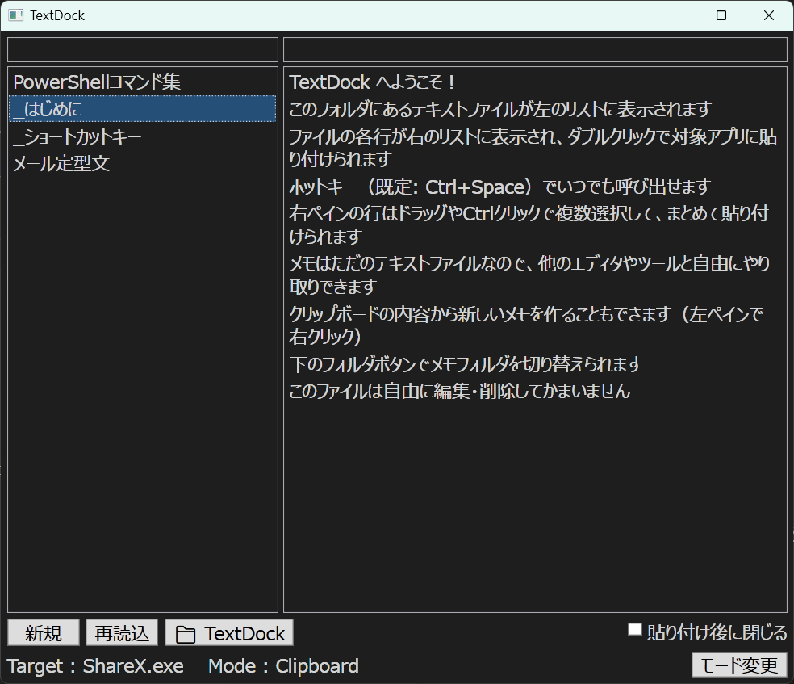

# TextDock

[English README is here](README.md)

TextDock は Windows 用の常駐型定型文ランチャーです。ホットキーで呼び出し、行を選ぶだけで、直前に作業していたアプリへそのまま貼り付けられます。

定型文はフォルダ内のただのテキストファイルです — 1ファイル1テーマ、1行1定型文。データベースも独自形式もありません。好きなエディタで編集でき、どんな同期ツールとも組み合わせられます。



## 特徴

- **グローバルホットキー**（既定: `Ctrl+Space`）— マウスカーソル付近にウィンドウが表示され、直前のアプリを貼り付け先として記憶
- **2ペイン構成** — 左にメモファイル一覧、右にその行一覧。ダブルクリックまたは `Enter` で貼り付け
- **3つの貼り付け方式** — Clipboard（`Ctrl+V`）/ `WM_CHAR` / `SendInput`。ターミナルやIME関連など相性の悪いアプリにはアプリ別設定で対応
- **クリップボード保護** — 貼り付け後、元のクリップボード内容を復元
- **複数行貼り付け** — ドラッグや `Ctrl+クリック` で複数行を選択してまとめて貼り付け
- **PowerShellに送る** — 右クリックから Windows PowerShell / PowerShell 7 で選択行を実行
- **クリップボードから作成** — コピーした内容をそのまま新しいメモに、または既存メモに追記
- **フォルダ切り替え** — 仕事用・自宅用・プロジェクト別など複数の定型文フォルダをワンクリックで切り替え
- **インクリメンタル検索** — 両ペインで前方一致/部分一致検索
- **テーマとフォント** — Light / Dark / カスタムカラー、任意のシステムフォント
- **二言語UI** — 日本語と英語。初回起動時はOSの言語に自動追従

## ショートカットキー

| キー | 動作 |
| --- | --- |
| `Ctrl+Space` | TextDock を表示 / 非表示（設定で変更可） |
| `Esc` | ウィンドウを閉じる |
| `Ctrl+N` | 新規メモを作成 |
| `F5` | 再読込 |
| `Ctrl+D` | フォルダ切り替えメニュー |
| `Ctrl+M` | 貼り付けモードを変更 |
| `Enter`（左ペイン） | 右ペインへ移動 |
| `Ctrl+E`（左ペイン） | 選択中のメモを編集 |
| `F2`（左ペイン） | 選択中のメモの名前を変更 |
| `Enter`（右ペイン） | 選択行を貼り付け |
| `Ctrl+C`（右ペイン） | 選択行をコピー |
| `Ctrl+V`（右ペイン） | 選択行を貼り付け |
| `Ctrl+S`（編集画面） | 保存 |

## TextClipboardViewer との併用

[TextClipboardViewer](https://github.com/yukiho72/TextClipboardViewer) は、現在のクリップボードのテキストを常に最前面のフローティングウィンドウに表示する姉妹ツールです。

2つのツールは補完関係にあります。TextDock はテキストをアプリへ「送り出す」側、TextClipboardViewer は今クリップボードに「入っている」ものを見せる側。併用すると、何をコピーしたかが常に見え、気になった内容は右クリックの「クリップボードから作成」で即座に TextDock のメモにできます。

## 動作環境

- Windows 10 / 11
- [.NET 8 Desktop Runtime](https://dotnet.microsoft.com/download/dotnet/8.0)

## ビルド

```powershell
git clone https://github.com/yukiho72/TextDock.git
cd TextDock
dotnet build
dotnet run --project src/TextDock
```

単体実行ファイルを作る場合：

```powershell
dotnet publish src/TextDock -c Release -r win-x64 --self-contained false
```

テストの実行：

```powershell
dotnet test
```

## データ形式

- メモは UTF-8（BOMなし）のテキストファイル。改行は LF / CRLF どちらも可
- 1行 = 1定型文。ファイル名は自由（拡張子の有無も任意）
- アプリ外で編集したファイルは自動反映（`.txt`）または `F5` で再読込
- 設定は `%LOCALAPPDATA%\TextDock\settings.json` に保存

## ライセンス

MIT
