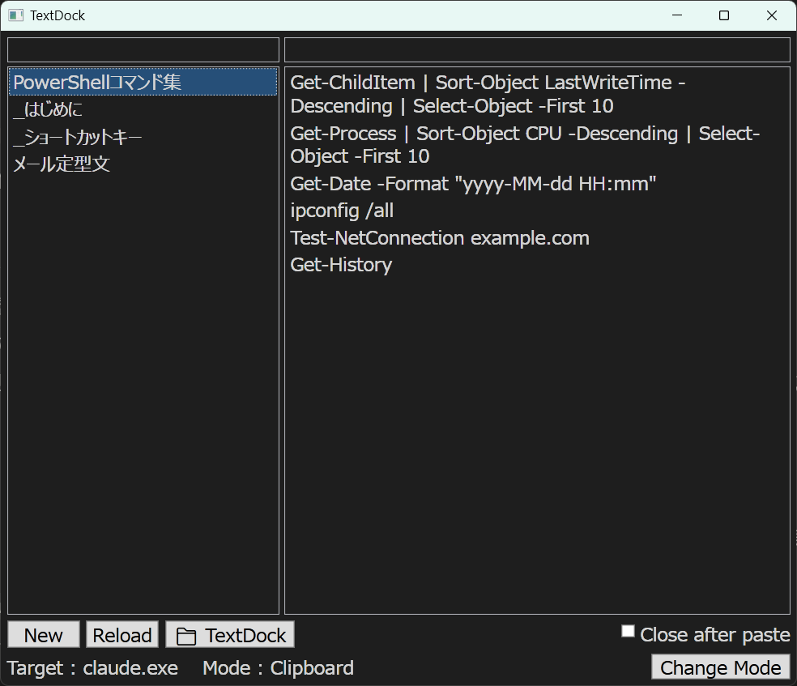

# TextDock

[日本語版 README はこちら](README.ja.md)

TextDock is a tray-resident snippet launcher for Windows. Press a hotkey, pick a line, and it is pasted straight into the app you were just working in.

Your snippets are plain text files in a folder — one file per topic, one line per snippet. No database, no lock-in. Edit them with any editor, sync them with anything.



## Features

- **Global hotkey** (default: `Ctrl+Space`) — the window pops up near your mouse cursor and remembers which app you came from
- **Two-pane view** — memo files on the left, their lines on the right; double-click or press `Enter` to paste
- **Three paste methods** — Clipboard (`Ctrl+V`), `WM_CHAR`, and `SendInput`, with per-application overrides for stubborn apps (terminals, IME-sensitive fields, etc.)
- **Clipboard protection** — your clipboard content is restored after pasting
- **Multi-line paste** — select multiple lines with drag or `Ctrl+click` and paste them together
- **Send to PowerShell** — right-click lines and run them in Windows PowerShell or PowerShell 7
- **Create from clipboard** — turn whatever you just copied into a new memo, or append it to an existing one
- **Folder switching** — keep separate snippet folders (work, home, per-project) and switch with one click
- **Incremental search** in both panes (prefix or partial match)
- **Themes and fonts** — Light / Dark / Custom colors, any system font
- **Bilingual UI** — Japanese and English, following the OS language on first launch

## Keyboard shortcuts

| Key | Action |
| --- | --- |
| `Ctrl+Space` | Show / hide TextDock (configurable) |
| `Esc` | Close the window |
| `Ctrl+N` | New memo |
| `F5` | Reload |
| `Ctrl+D` | Folder menu |
| `Ctrl+M` | Change paste mode |
| `Enter` (left pane) | Move to the right pane |
| `Ctrl+E` (left pane) | Edit the selected memo |
| `F2` (left pane) | Rename the selected memo |
| `Enter` (right pane) | Paste selected lines |
| `Ctrl+C` (right pane) | Copy selected lines |
| `Ctrl+V` (right pane) | Paste selected lines |
| `Ctrl+S` (editor) | Save |

## Works well with TextClipboardViewer

[TextClipboardViewer](https://github.com/yukiho72/TextClipboardViewer) is a companion tool that shows the current clipboard text in an always-on-top floating window.

The two tools complement each other: TextDock sends text *out* to your apps, TextClipboardViewer shows what is *in* your clipboard right now. Together you always know what you copied, and you can turn any interesting clipboard content into a TextDock memo with one right-click ("Create from Clipboard").

## Requirements

- Windows 10 / 11
- [.NET 8 Desktop Runtime](https://dotnet.microsoft.com/download/dotnet/8.0)

## Build

```powershell
git clone https://github.com/yukiho72/TextDock.git
cd TextDock
dotnet build
dotnet run --project src/TextDock
```

To create a standalone executable:

```powershell
dotnet publish src/TextDock -c Release -r win-x64 --self-contained false
```

Run tests:

```powershell
dotnet test
```

## Data format

- Memos are UTF-8 (no BOM) text files; LF or CRLF both work
- One line = one snippet; file names are free-form (extension optional)
- Files edited outside the app are picked up automatically (`.txt`) or via `F5`
- Settings are stored in `%LOCALAPPDATA%\TextDock\settings.json`

## License

MIT
